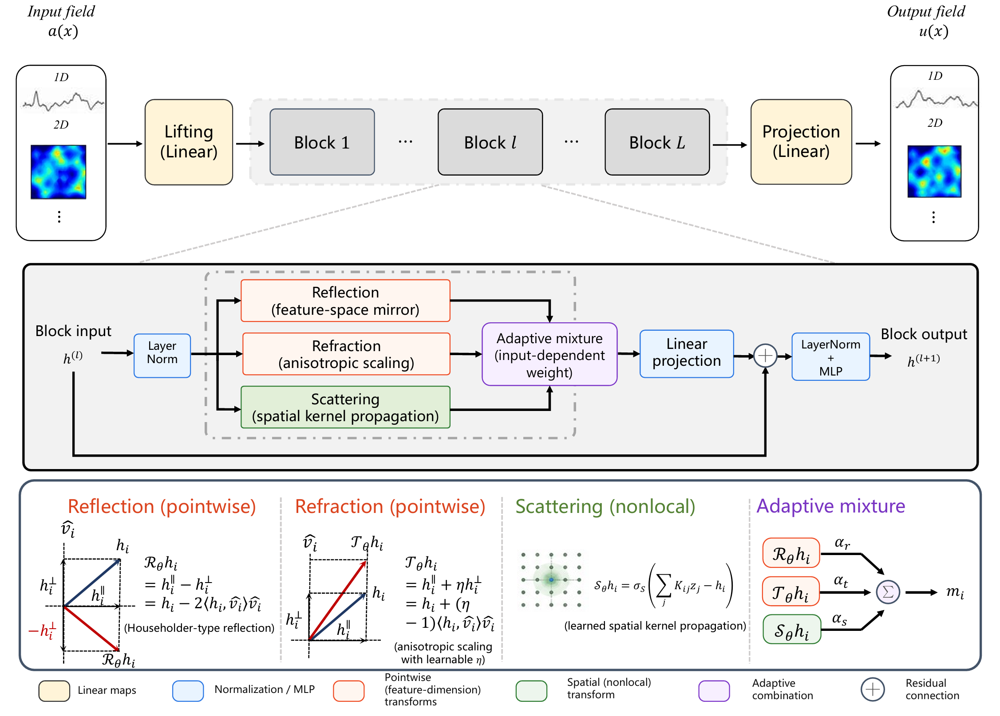

<!-- # Let There Be Light: Reflection, Refraction and Scattering for Neural Operators of Parametric PDEs -->


<p align="center">
  
<p>

<!-- <p align="center">
  
<p> -->


<p align="center">
  
  &nbsp;&nbsp;&nbsp;&nbsp;&nbsp;&nbsp;&nbsp;&nbsp;&nbsp;&nbsp;&nbsp;&nbsp;&nbsp;&nbsp;&nbsp;&nbsp;&nbsp;&nbsp;&nbsp;&nbsp;&nbsp;&nbsp;
  <br>
  <sub><b>¹ University of Science and Technology of China (USTC) </b> &nbsp;&nbsp;&nbsp;&nbsp;|&nbsp;&nbsp;&nbsp;&nbsp; <b>² Peking University (PKU) </b></sub>
<p>




#### **Title:** Let There Be Light: Reflection, Refraction and Scattering for PDE Neural Operators

#### **Authors:** Keke Wu, Yixuan Zhang and Jingrun Chen
`TODO: Update the arXiv link`
 
[](https://arxiv.org/abs/2111.02541) 

[**Overview**](#-overview) | [**Installation**](#-installation) | [**Datasets**](#-datasets) | [**Project Architecture**](#-project-architecture) | [**Training and Evaluation**](#-training-and-evaluation) |
[**Citation**](#-citation)

## 🔍 Overview

This repository presents a neural operator framework that leverages principles from light transport and physics-informed learning to solve parametric partial differential equations (PDEs) efficiently.
The framework learns an infinite-dimensional operator $\mathcal{G}_\theta$ that maps input functions to solution functions:

$$\mathcal{G}_\theta: \mathcal{A} \rightarrow \mathcal{U}$$

where $\mathcal{A}$ and $\mathcal{U}$ are function spaces.


## 📦 Installation

```bash
# Clone the repository and install dependencies
git clone https://github.com/wukekever/Light-inspired-neural-operator.git
cd Light-inspired-neural-operator
pip install -r requirements.txt
```

<details>
  <summary> Dependencies (click to expand): </summary>

  - Python >= 3.10
  - torch >= 2.0.0
  - numpy >= 1.24.0
  - scipy >= 1.10.0 (for loading `.mat` files)
  - h5py >= 3.8.0 (for loading v7.3 `.mat` files)
  - matplotlib >= 3.7.0 (for evaluation plots)
  - termcolor >= 2.3.0 (for colored logging)
  - Pillow >= 9.5.0 (for `make_title.py`)
  - gdown >= 5.1.0

</details>


## 🔗 Datasets
We provide datasets for Burgers equation, Darcy flow, Navier-Stokes equation, and the Geo-FNO NACA airfoil Euler benchmark. Data generation details are available in the paper.

**datasets:**
- [Burgers/Darcy/Navier-Stokes datasets](https://drive.google.com/drive/folders/1UnbQh2WWc6knEHbLn-ZaXrKUZhp7pjt-?usp=sharing)

- [Airfoil datasets](https://drive.google.com/drive/folders/1JUkPbx0-lgjFHPURH_kp1uqjfRn3aw9-?usp=sharing)

Alternatively, use the provided shell script in the Light-inspired-neural-operator repository to download the datasets directly:
```bash
# Download Darcy 2D dataset for example
bash ./scripts/download_darcy2d.sh
```

**Dataset Format:**

Datasets are provided as MATLAB files and each file is loaded as a tensor where the first index represents samples and remaining indices represent discretization dimensions.

Examples:
- `burgers_data_R10.mat`: Shape [1000, 8192] — 1000 samples on a 1D grid of 8192 points
- `Darcy2D_piececonst_r241_N1024_smooth1.mat`: Shape [1024, 241, 241] — 1024 samples on a 2D grid of 241×241
- `ns_V1e-3_N5000_T50.mat`: Shape [5000, 64, 64, 50] — 5000 samples on a 2D grid of 64×64 with 50 time steps
- `NACA_Cylinder_X/Y/Q.npy`: Geo-FNO NACA airfoil benchmark. Inputs are physical mesh coordinates `(x,y)` on a structured C/O mesh; optional computational coordinates `(xi,eta)` are appended; target channel `Q[:, 4]` is used as the Mach-number field by default.


## 📁 Project Architecture

```bash
tree
.
├── assets
│   ├── framework.png
│   ├── rainbow_title.png
│   ├── transparent-lino-logo.png
│   ├── transparent-pku-logo.png
│   └── transparent-ustc-logo.png
├── doc
│   ├── main.tex
│   └── overview.md
├── LICENSE
├── make_title.py
├── pyproject.toml
├── README.md
├── requirements.txt
├── scripts
│   ├── download_airfoil2d.sh
│   ├── download_burgers1d.sh
│   ├── download_darcy2d.sh
│   ├── download_navierstokes2d.sh
│   ├── run_eval_airfoil2d.sh
│   ├── run_eval_burgers1d.sh
│   ├── run_eval_darcy2d.sh
│   ├── run_eval_navierstokes2d.sh
│   ├── run_eval_temporal_error_navierstokes2d.sh
│   ├── run_train_airfoil2d.sh
│   ├── run_train_burgers1d.sh
│   ├── run_train_darcy2d.sh
│   └── run_train_navierstokes2d.sh
└── src
    ├── datasets
    │   ├── airfoil2d.py
    │   ├── Burgers1D
    │   │   └── burgers_data_R10.mat
    │   ├── burgers1d.py
    │   ├── common.py
    │   ├── Darcy2D
    │   │   ├── piececonst_r241_N1024_smooth1.mat
    │   │   └── piececonst_r241_N1024_smooth2.mat
    │   ├── darcy2d.py
    │   ├── data_infos.md
    │   ├── datatest.ipynb
    │   ├── __init__.py
    │   ├── NavierStokes2D
    │   │   └── ns_V1e-3_N5000_T50.mat
    │   └── navierstokes2d.py
    ├── eval.py
    ├── eval_airfoil2d_metrics.py
    ├── eval_temporal_error.py
    ├── logger.py
    ├── modules
    │   └── model.py
    ├── run_airfoil2d.py
    ├── run_burgers1d.py
    ├── run_darcy2d.py
    ├── run_navierstokes2d.py
    └── utils.py
```

## 🚀 Training and Evaluation
For training and evaluation, we provide separate shell scripts for each dataset. You can run them as follows:
```bash
# Train on Darcy2D Problem
bash ./scripts/run_train_darcy2d.sh
# Evaluate on Darcy2D Problem after training (Replace the **checkpoint path** in the script!)
bash ./scripts/run_eval_darcy2d.sh
```

## 📌 Citation

If you find this work useful, please cite:

`TODO: Update the citation after the information is available`
```bibtex
@article{wu2026light,
    title={Let There Be Light: Reflection, Refraction and Scattering for PDE Neural Operators},
    author={Keke Wu, Yixuan Zhang and Jingrun Chen},
    year={2026},
    eprint={},
    archivePrefix={arXiv},
    url={},
}
```

